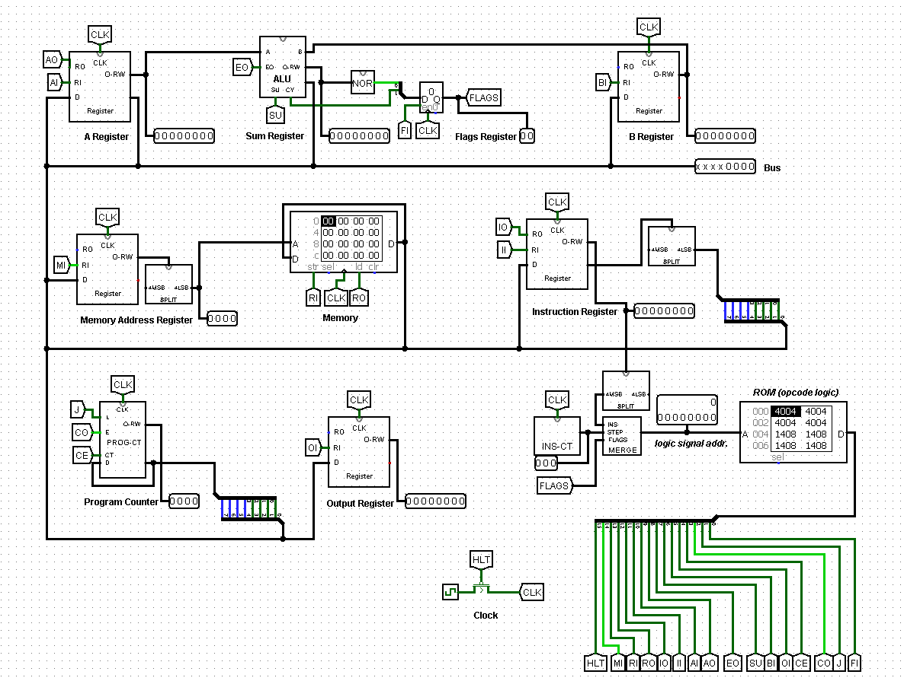

# 8-bit-CPU



A source code is a file that can be used to generate a program for a computer. It consists of two parts separated by an empty line:

1. Program
2. Data

The program part of the source code contains the instructions that the computer will execute, while the data part contains the values that will be written into memory and made available for the program to use.

Each line in the program part follows this structure (without the 3 backticks ```):

`<OPCODE> <OPERAND (in decimal)>`

A program can have multiple lines of code.

For example, a program (only the program part) that adds two numbers from memory locations 14 and 15, outputs the result, and then halts would look like this:

```
LDA 15
ADD 14
OUT
HLT
```

Moving on to the data part, each line represents a word that will be stored in memory. The structure of a single line in the data part is as follows (without the 3 backticks ```):

`<ADDRESS (in decimal)>: <VALUE (in decimal)>`

As an example, the data part for the aforementioned program (adding two numbers in memory locations 14 and 15) would look like this:

```
15: 14
14: 28
```

Therefore, the complete source code for the example program and data would look like this:

```
LDA 15
ADD 14
OUT
HLT

15: 14
14: 28
```

Keep in mind that the computer has only 16 memory locations, each capable of storing an 8-bit value. The addresses range from 0 to 15, while the values can be between 0 and 255. Additionally, the operand can only range from 0 to 15.
